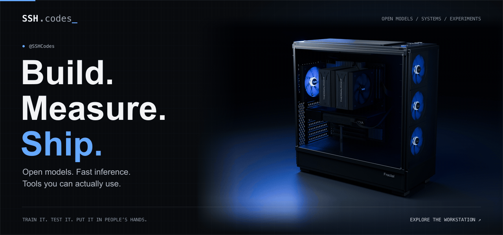

<a href="https://ssh.codes/#workstation-reconstruction">
  <picture>
    <source media="(prefers-reduced-motion: reduce)" srcset="assets/workstation-blue-detail.png">
    
  </picture>
</a>

  <a href="https://ssh.codes"><strong>Website</strong></a> &nbsp;·&nbsp;
  <a href="https://huggingface.co/ProCreations"><strong>Models & datasets</strong></a> &nbsp;·&nbsp;
  <a href="https://ssh.codes/blog"><strong>Build log</strong></a> &nbsp;·&nbsp;
  <a href="https://x.com/SSHCodes"><strong>X</strong></a> &nbsp;·&nbsp;
  <a href="mailto:me@ssh.codes"><strong>Get in touch</strong></a>

I'm **SSH**. I build open-weight models, fast inference stacks, and tools that run on your machine. I like measured results, source you can inspect, and projects you can actually use.

The workstation above is a **detailed Blender reconstruction of my real machine**, rendered with blue lighting and spinning fans. Explore the interactive version on [ssh.codes](https://ssh.codes/#workstation-reconstruction) to rotate it and change the lighting.

### Models, measured

**[The Grug Series](https://huggingface.co/ProCreations)** — Open-weight models trained to spend fewer tokens thinking, with GGUF builds for local use.

**[Auto](https://github.com/SSHdotCodes/auto)** — Local permission intelligence for coding agents. Checks proposed tool calls against your request and agent history, with support for Pi, OpenCode, and Hermes.

**[Black Hole Benchmark](https://bhbench.ssh.codes)** — One prompt, different models, actual compiled C++ renders. [Inspect the submissions →](https://github.com/SSHdotCodes/bhbench)

### Selected builds

| Project | What I’m building |
| :--- | :--- |
| **[GLM on Blackwell](https://github.com/SSHdotCodes/glm-5.3-flash-pro6000)** | Single-GPU GLM-5.3-Flash serving, RAM expert caching, DFlash2, and reproducible benchmarks. |
| **[Qwen on Blackwell](https://github.com/SSHdotCodes/qwen-3.8-flash-next-pro6000)** | Qwen3.8-Flash-Next inference tuning, full-context serving, and correctness checks on an RTX PRO 6000. |
| **[Second Opinion](https://github.com/SSHdotCodes/second-opinion)** | Let Claude bring other AI models into the work through MCP. |
| **[Videopaper](https://github.com/SSHdotCodes/Videopaper)** | Native macOS live wallpapers, including a real-time black hole ray tracer in Metal. |
| **[Codex RPC](https://github.com/SSHdotCodes/codex-rpc)** | Discord Rich Presence for the Codex CLI, with animated activity states. |

[More projects on ssh.codes →](https://ssh.codes/projects)

### The workshop

**Models & inference** &nbsp; PyTorch · LoRA · GGUF / llama.cpp · CUDA · MLX 
**Interfaces & systems** &nbsp; Python · C++ · TypeScript · Swift · Metal · WebGPU · Three.js · MCP 
**Hardware & hosting** &nbsp; RTX PRO 6000 Blackwell · Apple Silicon · Raspberry Pi · Docker

  
Contribution trail

   
  <picture>
    <source media="(prefers-color-scheme: dark)" srcset="https://raw.githubusercontent.com/SSHdotCodes/SSHdotCodes/output/github-contribution-grid-snake-dark.svg">
    
  </picture>

---

**Have something interesting to build?** [me@ssh.codes](mailto:me@ssh.codes)
